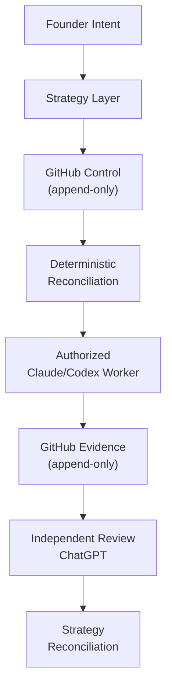

# DogBuild

[](https://github.com/mantoshkumar1/dogbuild/actions/workflows/ci.yml)

A local, file-based **project interface and authority layer** between coding agents (Claude Code, Cursor, Codex) with **ChatGPT** as the delegated reviewer and the **human owner** in ultimate authority. It keeps every agent operating from **one verified project state**, routes routine decisions through a deterministic authority gate, and interrupts the human only on real exceptions.

An experimental **deterministic control and orchestration layer** for coordinating multiple AI coding agents through GitHub and curated MCP interfaces, without requiring a human to manually relay context between them.

> Your coding agents coordinate through a verified state ledger instead of hidden conversations. You step in only when a decision genuinely needs you.

---

## Motivating workflow

DogBuild grew out of coordination friction the founder hit while building [PingStep](https://pingstep.dev/): implementation done by one coding agent, review done separately by another, with the human manually carrying the implementation result to the reviewer and the review findings back — every round of fixes. PingStep is a motivating example, not a DogBuild dependency or customer; day-to-day dogfooding currently runs against PhotoSahi and DogBuild itself (see Quickstart below). That manual transport is still how the alpha works — DogBuild does not yet automate it (see "What is actually running" below). Full account: [`vision.md`](vision.md).

## The Problem

AI agents can implement and review work. Without a durable control plane, the human becomes the message bus:

- Implementation agent completes work → human copies result to reviewer
- Reviewer provides findings → human carries feedback back to implementer
- Every round of fixes requires manual relay

**DogBuild explores how intent, authority, evidence, routing, and handoffs can become deterministic and auditable.**

---

## Status

- **Phase:** two-week MVP (founder tool / dogfood).
- **Framing:** built because the founder already needs it. Selling it is a **hypothesis to test later** — payment, demand, pricing, and distribution are **explicitly unvalidated** (see [`docs/commercial-assumptions.md`](docs/commercial-assumptions.md)).
- DogBuild's product activation and commercial constraints originated in the private Revenue Opportunity Lab. DogBuild owns its implementation and runtime truth. See [`docs/governance-boundaries.md`](docs/governance-boundaries.md) and the versioned [`docs/product-governance-source.md`](docs/product-governance-source.md) snapshot.
- **Tests run in CI, not just locally.** Every push and pull request against `main` runs the full suite (`python -m unittest discover -s tests`) on Python 3.9 and 3.11 — see [`.github/workflows/ci.yml`](.github/workflows/ci.yml). Merge authority itself is still human-only regardless of CI result; see [`docs/authority-model.md`](docs/authority-model.md).

### Current Status (September 2026)

**DogBuild is under active development and is not yet a production-ready autonomous-agent platform.**

This documentation reflects lived dogfooding, not theoretical design. Every status claim below links to its authoritative GitHub issue or PR.

### Component Status Legend

- `DOCUMENTED` — design and approach are recorded; working usage may be ahead of documentation
- `PROCESS_IN_USE` — live, being used for this task, but may not be widely adopted or fully tested
- `DESIGN_REVIEWED` — design decisions and principles settled; _implementation status varies_
- `LIVE_ENFORCEMENT_PENDING` — designed and reviewed; full mechanical enforcement awaits separate work
- `IMPLEMENTED / NOT DEPLOYED` — code exists and is merged; not yet active in production/live workflow
- `IN_REVIEW` — under independent verification; findings may require rework
- `PLANNED` — designed or sketched; implementation not yet started
- `DEFERRED` — identified and scoped; safety or blocking findings defer admission

---

## For Users: Quickstart

```bash
# 1. cd into your project
cd ~/Desktop/project/your-project

# 2. Initialize DogBuild (first time only)
dogbuild init . --objective "your project objective"

# 3. Launch DogBuild
dogbuild start
```

### Share a short status

Write a small report to any folder you choose. This is useful when you keep a separate, shared status area for your projects.

```bash
dogbuild report . --output-dir /path/to/reports/dogbuild \
  --changed "Added the report command" \
  --worked "Focused tests pass" \
  --blocked "Nothing" \
  --next "Open the pull request"
```

Each answer must be one short line. DogBuild does not copy project files, source code, or command output into the report, and it refuses obvious secret values. Pick the output folder yourself; DogBuild never hard-codes one.

### What is actually running

- **DogBuild is the visible interface.** You talk to DogBuild, not to a coding agent.
- **Claude Code is the current execution runtime.** It runs underneath, one turn per message. It can be replaced without losing the project.
- **ChatGPT is the master reviewer.** DogBuild does **not** talk to ChatGPT automatically — transport is manual in this alpha. When a reviewer decision is required DogBuild pauses and tells you so; it never pretends to have sent anything.
- **Persistent truth lives in the repository's `.ai/` state**, not in the Claude session. Sessions are disposable; the project is not.
- **The human is the final authority.** Anything needing a human decision blocks dispatch.

You land on the DogBuild prompt:

```
DogBuild

  Project:            PhotoSahi
  Stage:              PhotoSahi maintenance
  Current milestone:  <live milestone>
  Last verified:      <live verification>
  Human needed:       No

dogBuild>
```

`dogBuild>` is the project interface. Ask **"What's happening?"** at any time, or type `help` for the built-in commands. After every completed response the terminal returns to `dogBuild>`.

### Start options

```bash
dogbuild start                              # persistent dogBuild> interface
dogbuild start <repository-path>            # a specific repository
dogbuild start --dry-run                    # show what would happen; start nothing
dogbuild start --raw-claude                 # exec Claude Code directly (no DogBuild shell)
dogbuild start --new-session                # ignore the recovered Claude session
dogbuild start --permission-mode acceptEdits
```

`statekeeper …`, `psk …`, and `dogbuild …` remain interchangeable.

Initialization is independent by default. An upstream product or governance record is optional and must be supplied explicitly with `--source-name` and `--source-record`; DogBuild never injects the founder's private Lab into another user's repository.

### Built-in commands

Answered from local state — no Claude call, no tokens spent:

| Command | Shows |
|---|---|
| `help` | the command list |
| `status` | live project status in plain English |
| `next` | the exact next action |
| `plan` | execution plan and distance to delivery |
| `parked` | parked ideas |
| `review` | reviewer gate and how to get a ChatGPT decision (manually) |
| `refresh` | re-read live Git evidence and DogBuild state |
| `mode` | runtime, permission mode, session |
| `clear` | clear the screen |
| `exit` / `quit` | leave DogBuild (Ctrl-D also works) |

Plain questions like "What's happening?", "What's next?", "Did the tests pass?" are answered the same way. Anything else is a real instruction and goes to Claude Code.

---

## For Recruiters & Architects: Project Overview

### Intended Architecture



**Key principle:** DogBuild contains no AI and makes no semantic product decisions. It enforces boundaries—founder authority, append-only evidence, exact identity validation—while workers do their work.

---

## Design Principles

DogBuild operates on these settled principles:

- **GitHub records live control and execution state.** Chat is a control/wake interface only; evidence and routing decisions live on GitHub. (Documentation may be split across systems, as #183 itself demonstrates.)
- **DogBuild contains no AI and makes no semantic product decisions.** It enforces boundaries and routes work; humans and specialized agents make product calls.
- **Strategy carries founder intent and assigns work.** The human decides anything irreversible.
- **Workers do not self-start or broaden their authority.** Every task is explicitly bounded and reviewed.
- **Worker plans, findings, and verdicts are append-only on GitHub.** Corrections supersede earlier evidence without silently rewriting history.
- **Exact identity must be revalidated before writes.** Repository, task, role, generation, target, and requested effect are all subject to fresh validation.
- **Missing or conflicting evidence fails closed.** When truth is unclear, the system stops rather than guessing.
- **Implementation and independent review are separate roles.** The same session does not both implement and approve.
- **Infrastructure-critical functionality receives adversarial testing before deployment.** Happy-path passing tests are insufficient; security-negative, fault-injection, and high-volume cases must be proven.
- **Tool availability is capability, not authorization.** A tool being present does not mean a task is approved.

---

## Completed Work

| Component | Status | Evidence | Notes |
|-----------|--------|----------|-------|
| GitHub-first control-board | `DOCUMENTED` / `PROCESS_IN_USE` | [#180](https://github.com/mantoshkumar1/dogbuild/issues/180) | Durable source of truth for live state; append-only evidence |
| Three-server Cloudflare MCP portal | `DOCUMENTED` / `PROCESS_IN_USE` | [#169 comment 5721849420](https://github.com/mantoshkumar1/dogbuild/issues/169#issuecomment-5721849420) | Validated end-to-end; actively in use |
| MCP tool inventory and Matrix V3 classification (53 tools) | `DOCUMENTED` / `DESIGN_REVIEWED` | [#169 comment 5721849420](https://github.com/mantoshkumar1/dogbuild/issues/169#issuecomment-5721849420) | Classification complete; live enforcement pending (#169) |
| Founder/Strategy/worker authority model | `DOCUMENTED` / `PROCESS_IN_USE` | [#180 architecture](https://github.com/mantoshkumar1/dogbuild/issues/180) | GitHub-documented; enforced in practice for routing decisions |
| Append-only communication and evidence rules | `DOCUMENTED` / `PROCESS_IN_USE` | [#180 settled architecture](https://github.com/mantoshkumar1/dogbuild/issues/180) | Lived through all corrections; no silent rewrites |

### In-Development / Under Review

| Component | Status | Evidence | Blocker / Next |
|-----------|--------|----------|-----------------|
| DogBuild Control MCP package (read-only) | `IMPLEMENTED / NOT DEPLOYED` | [PR #173](https://github.com/mantoshkumar1/dogbuild/pull/173) (merged) | Awaiting #175 proof before deployment |
| Exact-SHA CI aggregation (`get_commit_ci`) | `IN_REVIEW` | [PR #184](https://github.com/mantoshkumar1/dogbuild/pull/184) (draft), [#175 finding](https://github.com/mantoshkumar1/dogbuild/issues/175#issuecomment-5722270203) | Producer correction required; see #175 |
| Comment-policy tool (`handle_comment_change_request`) | `IN_REVIEW` | [PR #174](https://github.com/mantoshkumar1/dogbuild/pull/174) (open) | Unresolved review findings; awaiting bounded correction |
| Schema 4 listener prototype | `DEFERRED` | [PingStep PR #630](https://github.com/mantoshkumar1/pingstep/pull/630) (draft) | Safety findings identified; re-admission deferred pending #466 |

### Planned / Future

| Component | Target | Relates To |
|-----------|--------|-----------|
| Exact-SHA CI staging-push evidence | Reviewed and correct | [#175](https://github.com/mantoshkumar1/dogbuild/issues/175) |
| Least-privilege identity and repository-scope proof | Foundation for bounded agent execution | [#167](https://github.com/mantoshkumar1/dogbuild/issues/167) |
| Pre-write authorization gateway | Revalidate exact authority before GitHub mutations | [#176](https://github.com/mantoshkumar1/dogbuild/issues/176) |
| Reusable onboarding and session conformance | Blank-session entry points and boundaries | [#170](https://github.com/mantoshkumar1/dogbuild/issues/170) |
| Fourth-server deployable surface | Future custom MCP server (no deployment authority yet) | [#164](https://github.com/mantoshkumar1/dogbuild/issues/164) |
| Real agent invocation | Only after listener safety findings are repaired and re-admitted | [#466](https://github.com/mantoshkumar1/pingstep/issues/466) |

---

## Immediate Roadmap

In order of planned execution:

1. **Correct and independently review PR #184** ([#175](https://github.com/mantoshkumar1/dogbuild/issues/175))
   - Restore all pre-existing test lines
   - Add real same-run rerun-attempt regression test
   - Model production `filter=latest` semantics
   - Complete adversarial/high-volume/coverage evidence
   - Producer self-review before new independent review

2. **Reconcile or exclude PR #174** ([#174](https://github.com/mantoshkumar1/dogbuild/pull/174))
   - Bounded producer correction if issue remains open
   - Clear resolution on scope vs. future work

3. **Complete least-privilege identity and repository-scope proof** ([#167](https://github.com/mantoshkumar1/dogbuild/issues/167))
   - Restricted identity separate from founder credentials
   - Repository allowlist mechanically enforced

4. **Implement deterministic pre-write gateway** ([#176](https://github.com/mantoshkumar1/dogbuild/issues/176))
   - Revalidate exact authority before every mutation
   - Fail closed on identity/scope mismatch

5. **Complete onboarding and fresh-session conformance** ([#170](https://github.com/mantoshkumar1/dogbuild/issues/170))
   - Reusable entry points for blank sessions
   - Explicit session boundary acknowledgement

6. **Decide and review fourth-server deployable surface** ([#164](https://github.com/mantoshkumar1/dogbuild/issues/164))
   - Define exact scope for any additional custom MCP server
   - Independent review of design and scope

7. **Deploy only with explicit authorization and rollback evidence**
   - Founder-only gate for any live registration
   - Rollback and kill-switch proven before go-live

8. **Repair and re-admit listener before real agent invocation** ([#630](https://github.com/mantoshkumar1/pingstep/pull/630))
   - Address webhook authenticity, state safety, schema validation findings
   - Re-review exact head when re-admitted

9. **Prove complete workflow through real-system boundaries**
   - End-to-end canary: task → plan → branch → implementation → review → merge
   - No human relay, verified evidence, founder approval gates intact

---

## What This Is NOT (Yet)

- **Not a production-ready autonomous-agent platform.** It is under active development and explicitly defers deployment of several components.
- **Not a claim of exactly-once distributed execution.** That bar is not met by current test evidence; see #175.
- **Not an unrestricted GitHub administration layer.** Repository protections and authorization gates remain enforced.
- **Not a replacement for repository protections, CI, or human judgment.** Those remain authoritative.
- **Not a deployed fourth MCP server.** Custom control server exists but is not yet deployed.
- **Not a finished commercial product.** Payment, demand, pricing, and distribution are explicitly unvalidated.

---

## Milestones Achieved

These incremental steps show progress toward the eventual vision:

- Defined founder/Strategy/worker authority model ([#180](https://github.com/mantoshkumar1/dogbuild/issues/180))
- Made GitHub the durable communication and evidence layer for live state ([#180](https://github.com/mantoshkumar1/dogbuild/issues/180))
- Built and validated three-server MCP portal path ([#169](https://github.com/mantoshkumar1/dogbuild/issues/169))
- Inventoried and classified live 53-tool MCP surface ([#169 comment 5721849420](https://github.com/mantoshkumar1/dogbuild/issues/169#issuecomment-5721849420))
- Implemented narrow read-only DogBuild control-server package ([PR #173](https://github.com/mantoshkumar1/dogbuild/pull/173))
- Implemented exact-SHA CI aggregate candidate ([PR #184](https://github.com/mantoshkumar1/dogbuild/pull/184))
- Proved visibility of real staging-push workflow evidence (through existing Actions API)
- Built deterministic listener prototype and identified its safety gaps ([PingStep PR #630](https://github.com/mantoshkumar1/pingstep/pull/630))
- Defined future pre-write authorization gateway ([#176](https://github.com/mantoshkumar1/dogbuild/issues/176))
- Began adversarial verification and admission work (ongoing)

---

## Scope Discipline (MVP)

Local-only · file-based · **no** OpenAI API · **no** browser automation · **no** hosted backend · **no** accounts · **no** payment · **no** dashboard · **no** cloud sync. One canonical protocol; thin per-agent adapters (never four implementations).

---

## Quick Links

| Purpose | Link |
|---------|------|
| Control board (live strategy and routing) | [#180](https://github.com/mantoshkumar1/dogbuild/issues/180) |
| Documentation source-of-truth task | [#183](https://github.com/mantoshkumar1/dogbuild/issues/183) |
| MCP tool curation | [#169](https://github.com/mantoshkumar1/dogbuild/issues/169) |
| Exact-SHA CI proof | [#175](https://github.com/mantoshkumar1/dogbuild/issues/175) |
| Least-privilege identity | [#167](https://github.com/mantoshkumar1/dogbuild/issues/167) |
| Listener refinement (deferred) | [PingStep #630](https://github.com/mantoshkumar1/pingstep/pull/630) |
| Vision and motivating example | [vision.md](https://github.com/mantoshkumar1/dogbuild/blob/main/vision.md) |
| Related article on the problem | [Why Am I Still the Message Bus Between My AI Agents?](https://mantoshkumar1.github.io/insights/message-bus-between-ai-agents.html) |

---

## Docs

| Doc | Purpose |
|---|---|
| [`vision.md`](vision.md) | Full product vision: coordination/control layer, roles, control loop, first prototype vs. eventual product, milestone roadmap. |
| [`AGENTS.md`](AGENTS.md) | Role boundaries, responsibilities, and expectations for human, Strategy, and worker agents. |
| [`docs/authority-model.md`](docs/authority-model.md) | Roles, gate hierarchy (human > ChatGPT > agents > keeper), gate behavior. |
| [`docs/mvp-scope.md`](docs/mvp-scope.md) | Exactly what's in and out of the two-week MVP. |

---

## About the Builder

**Mantosh Kumar** is a Staff Software Engineer based in Toronto, specializing in platform engineering, automation, and distributed systems validation.

- **GitHub:** [mantoshkumar1](https://github.com/mantoshkumar1)
- **Website:** [mantoshkumar1.github.io](https://mantoshkumar1.github.io)
- **Article on this problem:** [Why Am I Still the Message Bus Between My AI Agents?](https://mantoshkumar1.github.io/insights/message-bus-between-ai-agents.html)

DogBuild is built and actively dogfooded in public. It represents one engineer's approach to a real coordination problem; it is not affiliated with any employer and does not represent an organizational position.

---

## Further Reading

- [**vision.md**](https://github.com/mantoshkumar1/dogbuild/blob/main/vision.md) — Full product vision: coordination/control layer, roles, control loop, first prototype vs. eventual product, milestone roadmap.
- [**AGENTS.md**](https://github.com/mantoshkumar1/dogbuild/blob/main/AGENTS.md) — Role boundaries, responsibilities, and expectations for human, Strategy, and worker agents.
- [**Control Board #180**](https://github.com/mantoshkumar1/dogbuild/issues/180) — Live routing, current lanes, admission gates, and immediate next steps.
